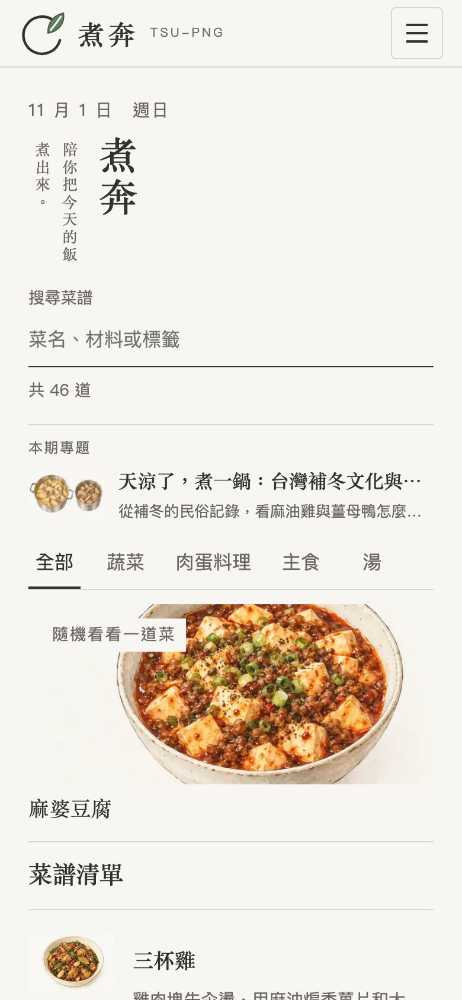
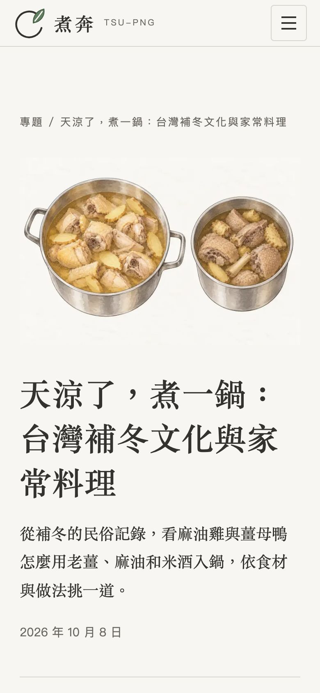

# 補冬專題：第二階段發布驗證

站主已指示發佈。第一階段 PR #75 由站主合入，部署 run 37728227514 在 main `ddcfc22` 成功；麻油雞與薑母鴨正式網址均回應 200，標題正確。代理沒有合入 PR 或執行真實部署。

第二階段從最新 main 開 `content/winter-food-culture`，只加入專題正文、封面、來源紀錄、推薦檔期及審閱證據；不改網站程式、菜譜配方或其他內容。

## 發布設定

- 依站主發佈指示改為 `draft: false`，五個核准來源沿用，不重新取源或改寫事實。
- 首頁推薦每年 11/1 至翌年 1/31，包含起訖日，順位 2；無當期文章時仍為既有〈備菜與預處理〉。
- 正文與相關連結指向已發布的麻油雞、薑母鴨、薑與米酒條目。
- 封面為原生 imagegen 水彩圖，WebP 1536×1024、156,168 bytes，已目視核對；提示詞紀錄沿用 `image-prompts.json`。

## 檢查

- `pnpm check`、`pnpm check:content --launch` 通過；來源段落對照、封面與正式輸出符合規則。
- `pnpm test`：314 項通過。
- `E2E_PORT_BASE=4421 pnpm test:e2e`：176＋45＝221 項通過。
- 發布版瀏覽器探測：10/31 常青、11/1 補冬、1/31 補冬、2/1 常青；首頁連進文章、兩道菜譜反向連結與 390／1366px 無水平溢出通過。
- 已清除本 worktree 的 Astro 圖片快取，保留 main 的 WebP 品質 70、CSS 內嵌與圖片尺寸設定。
- 獨立 reviewer 的發布 metadata 差異審閱無產品問題；來源文字與圖片沿用前一階段已接受的審閱。

## 畫面

