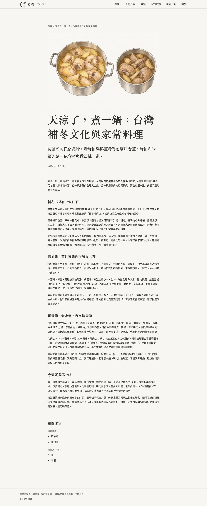
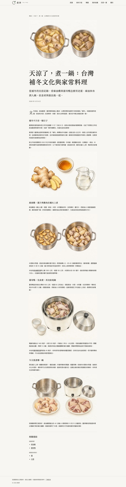
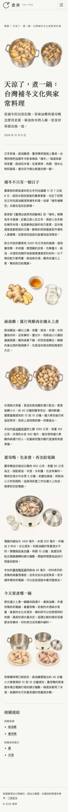

# 補冬專題：正文圖文更新

站主先確認技能原則，再指示更新既有專題。沿用五個已核准來源，修改 `content/topics/winter-food-culture/topic.md`，沒有修改菜譜配方或來源網址；後續整合 main 的新版面時，另修正正文圖片的共用尺寸宣告。先前本地的技能更新一併保留。

## 圖文安排

| 小節               | 插畫                       | 閱讀用途                                                                 |
| ------------------ | -------------------------- | ------------------------------------------------------------------------ |
| 補冬不只有一個日子 | shared-aromatics.webp      | 接在家常應景食材段落後，說明兩份配方共用薑、麻油與米酒，沒有臆造民俗儀式 |
| 麻油雞             | chicken-ginger-stages.webp | 比較薑片邊緣微捲與雞肉表面轉白的煸炒狀態，尚未加入湯水                   |
| 薑母鴨             | duck-electric-cooker.webp  | 傳統電鍋的內外鍋、可拆鍋蓋與兩杯外鍋用水；不推定杯容量                   |
| 今天要煮哪一鍋     | meat-and-equipment.webp    | 比較生雞肉配湯鍋、生鴨肉配電鍋，避免重複封面成品圖                       |

四張圖以原生 imagegen 獨立生成，同一畫風，各圖皆目視核對，沒有重產；提示詞與原始生成位置見 `image-prompts.json`。圖已轉為 WebP 1536×1024，各為 104,644、142,148、122,624、150,994 bytes。原始 PNG 留在生成目錄，正式圖片均在專題資料夾。

## 文案與版面

精簡重複的菜譜操作敘述，維持文化、料理差異與選菜的流向。改前後的數字集合一致，四個小節標題與來源對照逐字相同；南北習俗限定為辭典記載，電鍋行程總時間的來源缺口保留。沒有新增健康功效、個人經驗或來源未載的說法。

啟用 `editorialLayout: true`，只放大正文開頭第一段首字，其他發布欄位、推薦檔期及關聯不變。實際版面量測：1366／651px 首字與一般字的高度比為 2.55；390／320px 為 1.00。四張正文圖保持 3:2、懶載入，200% 文字與 320px 重排沒有水平溢出。桌機與手機全頁截圖已目視檢查。

## 驗證

- `pnpm check`、`pnpm check:content --launch` 通過。
- `pnpm test`：319 項通過。
- `E2E_PORT_BASE=4421 pnpm test:e2e`：182＋45＝227 項通過。
- 獨立 reviewer 對文案、來源對照、四張圖與圖文狀態審閱無重大問題。
- 已提交供 PR 審閱，合入與真實部署仍由站主依專案流程完成。

## 預覽

## 最新 main 整合

保留 main 的專題頁置中與桌機 46rem 欄寬。原正文圖片仍宣告 40rem，新增回歸測試在 800px 重現宣告640px、實際736px；修正為49rem視窗以上宣告46rem，其他視窗扣3rem頁面留白。尺寸測試同時涵蓋既有figure與四張Markdown正文圖，避免漏測。17項相關瀏覽器測試由失敗轉為通過，獨立 architect與reviewer確認此共用邊界。

更新後在1366、800、651、390、320px的實際正文圖，其sizes宣告與渲染寬度誤差不超過1px；首字比例與3:2圖片、無溢出檢查仍通過。修改前與修改後截圖均在最新main的相同46rem置中版面重建，避免比較不同版面。

最新 main 整合及正文圖片 sizes 修正後，`pnpm check`、內容門檻與319項單元測試通過；完整瀏覽器測試184＋45＝229項通過。
