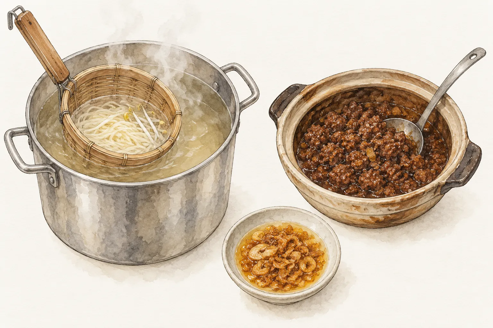
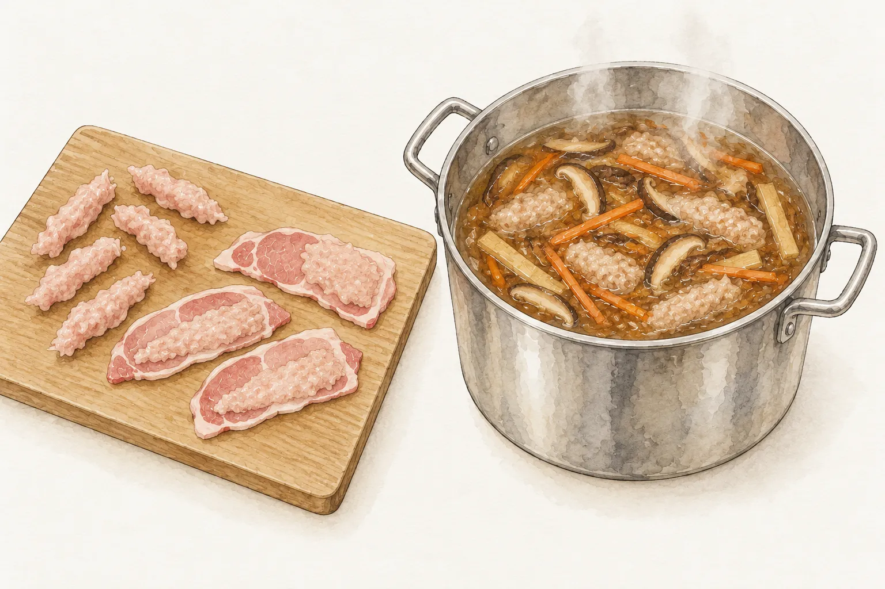
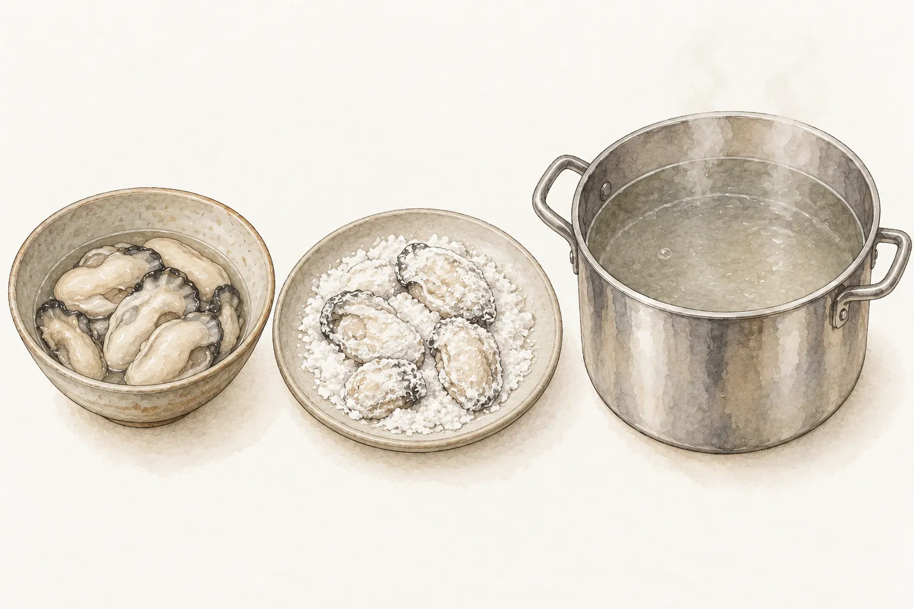
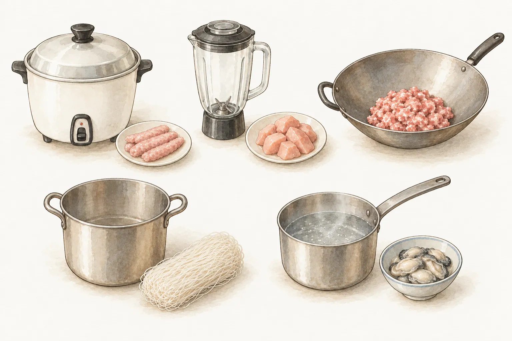

交通部觀光署介紹臺灣小吃時，炒米粉和臺南擔仔麵都在名單上；教育部的台語辭典也把鹽酥雞記為一種小吃。這幾樣在本站都有用家裡鍋具做的菜譜，另有一道同樣讓蚵仔先裹粉的蒜泥蚵仔。

## 點心、擔仔與夜市

台語把正餐以外的食物叫「點心」，辭典舉的例子有糕餅，也有小吃；和它相對的詞是「正頓」，也就是正餐。辭典沒有替「小吃」另立定義，小吃在這裡是點心的一種。

賣小吃的攤子，台語叫「擔仔」，辭典的解釋就是攤子、攤販，麵攤說成「麵擔仔」。夜市在辭典裡是晚上營業的市場，通常由賣小吃或日用品的攤位聚在一起。觀光署介紹夜市時也寫到，各地夜市集中了許多小吃，各有自己的特色。

夜市怎麼形成，各地情況不同。以高雄六合夜市為例，觀光署記載 1950 年起，大港埔一帶的空地陸續聚集小吃攤，先形成大港埔夜市，後來擴大成今天的六合夜市。

擔仔麵的名字也來自擔子。辭典把它記為臺南小吃，做法是在油麵上加少許用沙鍋燉的肉燥，因為早期挑著擔子沿街賣而得名。1969 年《臺南文化》刊出的〈擔仔麵史話〉，轉述了一則以「據說」開頭的掌故。清末臺南有位撐船運貨的洪芋頭，在船少的淡月挑麵擔到水仙宮前擺攤，擔上掛著寫有「度小月」的燈籠，客人蹲在擔子旁吃麵。原文以「據說」轉述，這裡只當作 1969 年《臺南文化》記載的傳說。

## 五道菜各自的特色

### 炒米粉

辭典收的詞是「米粉炒」，近義詞就是炒米粉，解釋為把食材、調味料和米粉一起用油炒熟，稱它是有名的臺式料理；觀光署則把炒米粉列在臺灣小吃裡。

米粉這項食材，新竹市文化局建檔的一篇文章稱新竹米粉是具代表性的特產。文章提到當地米粉業者的祖先多來自福建惠安，新竹風強雨少，有利風乾米粉；日治中期以前，新竹生產的米粉以粗條的水粉為主，細絲的炊粉約在 1920 年才引進。這段寫的是米粉的產地與製法，沒有談到炒米粉這道菜的來歷。本站的版本見[台式炒米粉](/recipes/taiwanese-fried-rice-noodles/)。

### 肉燥麵

辭典對肉燥的解釋，是把五花肉絞碎，和蔥、香菇等一起炒過，再加醬油熬煮，多半用來拌麵或拌飯。肉燥淋在白飯上，南部叫肉燥飯，辭典也記下中北部慣稱滷肉飯。

麵攤怎麼煮麵，舊文獻有一段具體的記錄。1953 年《臺南文化》的〈担仔麵〉寫當時臺南中正路「度小月」的擔仔麵，一大把切麵配一撮豆芽菜或青菜，放進湯鍋，剛熟就撈起，再澆上清湯、肉燥和蔥頭油。辭典另收「摵仔麵」，用類似竹籠的撈麵器具在熱湯裡上下抖動，煮熟後加湯頭和配料，並把它列為擔仔麵的近義詞。

本站的[肉燥麵](/recipes/minced-pork-noodles/)是菜譜的版本，用豬絞肉配意麵，和辭典寫的五花肉、擔仔麵用的油麵都不一樣。

### 肉羹湯

辭典替「肉羹」收了兩個意思。一個指食品，把肉搥成漿抓成條，或在肉片外裹上肉漿或芡粉後煮熟；另一個指用這種肉羹調味煮成的湯。辭典的「魚漿」條，也把肉羹列為魚漿常見的用途之一。

肉羹也有挑擔賣的例子。國家文化記憶庫收有高雄市岡山眷村文化協會建檔的欣欣鴨肉羹，第一代老闆挑擔到市場邊賣鴨肉羹，攤子經營六十多年，2019 年因欣欣菜場拆除而結束。這是單一攤子的記錄。本站的版本見[肉羹湯](/recipes/pork-thick-soup/)。

### 鹽酥雞

辭典的詞條寫作「鹹酥雞」，記為一種小吃，做法是雞胸肉切小塊，用醬油、糖、酒和五香粉等醃過，裹麵粉或地瓜粉炸到金黃，再拿出來賣。農業部桃園區農業改良場介紹[九層塔](/ingredients/thai-basil/)時提到，臺灣的九層塔分紅骨、青骨兩類，青骨的味道較清，常用在湯品和鹽酥雞。

本站的[鹽酥雞](/recipes/salt-crispy-chicken/)同樣用雞胸肉，醃料有醬油膏、糖、米酒和五香粉，裹的是地瓜粉，起鍋前放九層塔一起炸。

### 蒜泥蚵仔

觀光署介紹臺灣的海鮮時寫到，牡蠣又叫蚵仔，在臺灣主要產在西南沿海和澎湖。辭典收的蚵仔小吃裡，蚵仔麵線是把蒸過的土黃色麵線煮成糊，加入裹粉後稍微煮過的蚵仔；蚵仔煎則把蚵仔和地瓜粉、水調在一起，和青菜、蛋下平底鍋油煎。

本篇查到的公開資料沒有記錄蒜泥蚵仔的來歷，所以把它當成一道家常做法。它和蚵仔麵線一樣讓蚵仔先裹粉再下水煮，用的是粗地瓜粉。做法見[蒜泥蚵仔](/recipes/garlic-oysters/)。

## 家裡怎麼做

攤子的油炸用油有公開記錄。2013 年食品藥物管理局（今食品藥物管理署）說明，餐飲業油炸油的稽查對象涵蓋夜市攤販、路邊攤、小吃店等 10 種業態；2009 年衛生署也呼籲餐飲業者正確使用油炸油，劣化到一定程度就整鍋換新。兩份都是針對營業者的規範。

本站的五份菜譜改用家裡的鍋具。麵攤在一鍋熱湯裡煮麵，[肉燥麵](/recipes/minced-pork-noodles/)則分成炒鍋煮肉燥、另一鍋水煮麵；肉羹本身是先用肉漿做好的食品，[肉羹湯](/recipes/pork-thick-soup/)直接用現成肉羹，湯底交給電鍋。[台式炒米粉](/recipes/taiwanese-fried-rice-noodles/)的乾米粉先燙再燜軟，才下炒鍋拌炒。另外兩道要顧溫度，[鹽酥雞](/recipes/salt-crispy-chicken/)用約 150°C 的油炸；[蒜泥蚵仔](/recipes/garlic-oysters/)讓水溫維持在約 85～90°C 煮蚵仔。

## 怎麼選

時間最短的是蒜泥蚵仔，約 15 分鐘；接著是肉燥麵 25 分鐘、炒米粉 30 分鐘。鹽酥雞約 50 分鐘，其中 30 分鐘在醃肉；肉羹湯約 65 分鐘，湯底分兩段用電鍋煮。

要當一餐的主食，看炒米粉或肉燥麵，前者 3 人份、有高麗菜等蔬菜一起炒，後者 2 人份、乾拌一碗麵。想煮一鍋湯，肉羹湯是 4 人份，需要電鍋。鹽酥雞和蒜泥蚵仔都是 2 人份的配菜，一道要顧油溫，一道要顧水溫；鹽酥雞還要果汁機打醃汁。

口味可以從材料看。炒米粉有[紅蔥頭](/ingredients/shallot/)、香菇、蝦米和烏醋；肉燥麵靠紅蔥蒜、醬油和五香粉；肉羹湯的湯底用雞骨和柴魚片，再加香菇，最後以烏醋和胡椒粉調味。鹽酥雞的醃汁有蒜和五香粉，炸好撒胡椒鹽與辣椒粉；蒜泥蚵仔的醬汁是沒有加熱的蒜泥拌醬油，蚵仔放在九層塔上。
