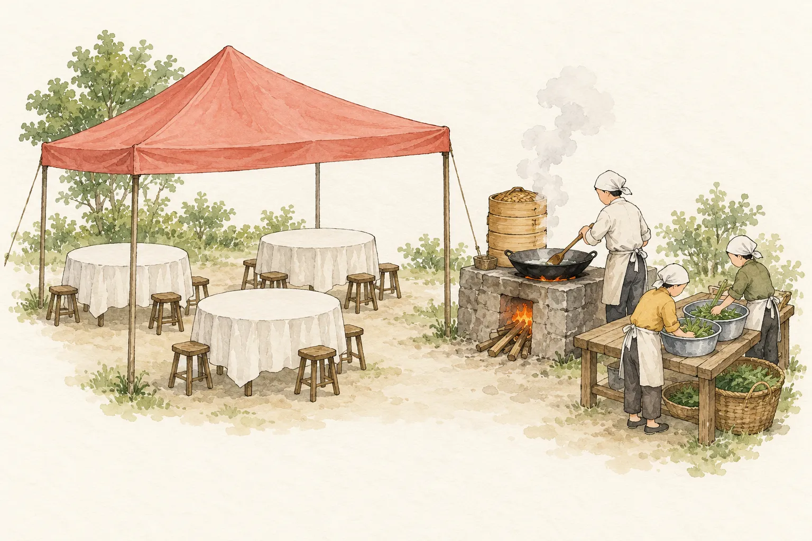
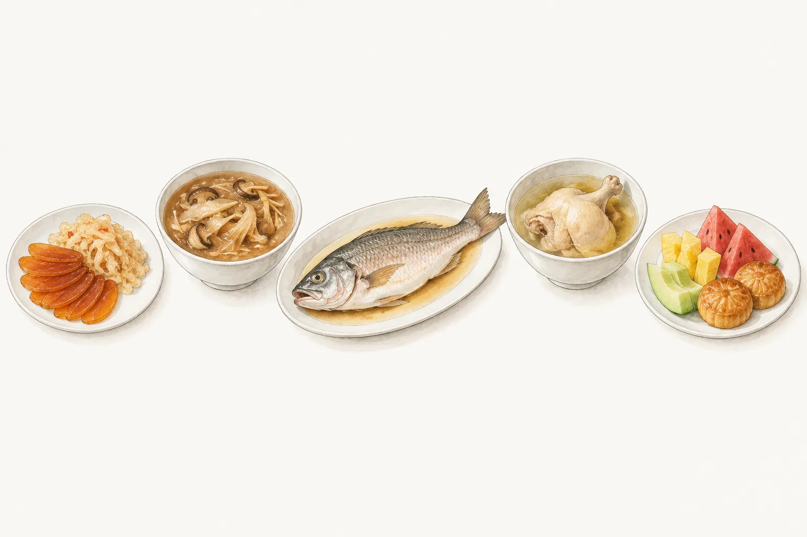
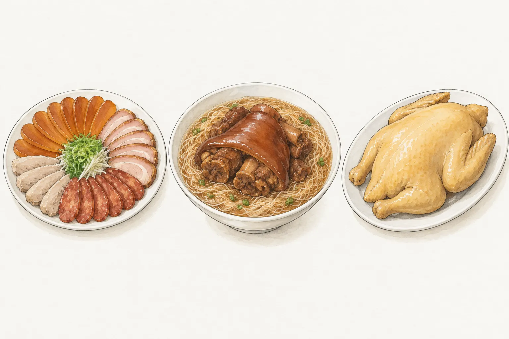
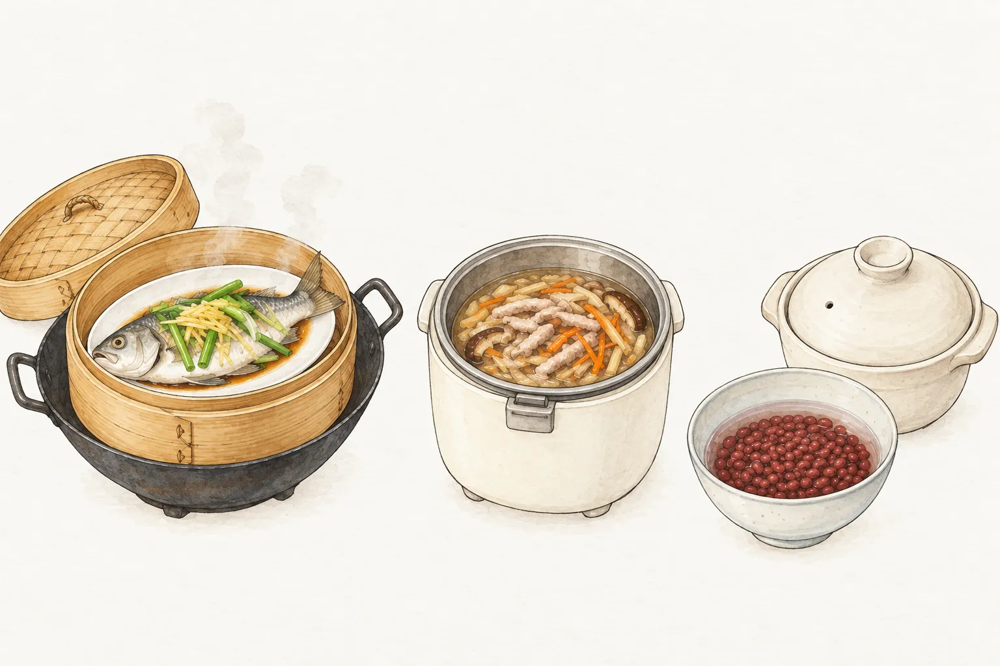

主人辦桌，客人「食桌」。教育部《臺灣台語常用詞辭典》把「辦桌」解釋為設宴、辦酒席，由掌廚的人到家裡備好酒菜招待客人，分類放在飲食與婚喪喜慶底下。中研院《數位文化電子報》2015 年的介紹把兩個字拆開來看，「辦」是辦理，「桌」指桌上的菜。這一桌菜不會同時端上來，從冷盤、羹湯到最後的甜點和水果，各有先後。

## 辦桌、流水席與總舖師

教育部《重編國語辭典修訂本》對「流水席」的解釋，是酒菜持續供應、客人隨到隨吃、吃飽就走的請客方式，例句是建醮時鎮上連擺三天三夜。《台灣光華雜誌》2023 年的辦桌報導，也把流水席放在宮廟為神明壽誕辦的慶醮宴。信眾認購幾桌，客人吃完一攤再換一攤，新一批人坐下就換一副碗筷，菜色多是八寶丸、酸筍燉豬腸、羊肉和涼拌豬肝，主辦不收紅包。流水席是辦桌的一種形式。

主持辦桌的大廚叫總舖師。台語辭典的釋義只有「大廚師」幾個字，近義詞列了「總舖」「廚子」；中研院電子報補充，南部也稱「刀煮師傅」。

辦桌和外燴常被放在一起講。高雄內門翔龍筵席第三代的李芝瑜，在《高雄畫刊》2019 年的訪問中認為兩者精神不同。辦桌從爐灶、鍋具、桌椅，到湯匙、調味料、餐巾紙，都歸總舖師負責；食材可以先處理，每盤菜卻都要在現場下鍋。她認為這是外燴取代不了的地方。

## 搭棚、起灶，一整團人

辦桌的場地常在戶外。《光華》1995 年的〈湯湯水水話台菜〉寫到家門口、馬路邊、廣場，或是活動中心、學校禮堂，棚子搭好、桌椅排好，總舖師就在現場開煮。內政部移民署新住民數位資訊 e 網的介紹，則提到路邊、廟口廣場和里民活動中心，旁邊架起爐灶與備菜桌，食材當場烹煮。

辦桌的場合很多。《高雄畫刊》2010 年訪問的總舖師章銘勝說，以前不只結婚，長輩做壽、嬰兒滿月、入厝、祭拜神明、親友過世、工廠尾牙，都會請總舖師來辦。中研院電子報另外列出宗教上的天子宴、齋醮宴、普渡宴，以及春酒。

一場辦桌要靠分工。國立臺灣歷史博物館「臺灣女人」網站的〈鄰里婦女「做水腳」〉記錄，總舖師決定整場的菜色與流程，底下的學徒、幫廚叫「大工」，多半是男性。洗菜、備料、端盤、洗碗的幫手叫「水腳」，以女性為主，這是中南部的叫法，北部常說「小工」「女工」。

早年的辦桌更仰賴鄰居。《高雄畫刊》2010 年的報導寫，以前鄉下辦喜事，食材由主家準備，左右鄰居幫忙搭竹棚、借出鍋盆和椅子，總舖師只管煮。後來總舖師的團隊自備爐具與餐具，連採購、運輸、租桌椅也一起包辦。《高雄畫刊》2017 年的報導把這個轉變落在內門的「郭三湯」。1960 年代，廚師湯四福、湯豬角和菜販郭章旗自己帶桌椅、餐具和廚具到現場。中研院電子報引用的研究則寫，民國 60 年以後才有布棚、桌椅碗盤出租的專業分工。

高雄內門有「總舖師原鄉」之稱。《高雄畫刊》2010 年那篇報導提到，當時全鄉一萬多人，超過一百五十組人以辦桌為業，大約每五戶就有一戶。

## 一桌菜的出菜順序

移民署的介紹把辦桌菜分成冷盤、熱炒、主菜、湯、點心和水果，依先後上桌。下面的順序都是總舖師或研究者受訪時說的做法，場合不同，第一道就可能不同。

### 冷盤先上

移民署的介紹說，第一道通常是冷盤，例如涼拌海蜇皮、烏魚子。冷盤放得住，客人晚到也不必擔心。《光華》2023 年報導的喜宴，從雙喜、四喜拼盤開始；《高雄畫刊》2017 年記錄內門湯卿炉師傅辦的一場婚宴，開席第一道是五子拼盤。

例外也有。中研院臺灣史研究所的曾品滄在《光華》2023 年報導中舉例，長輩祝壽宴和神明壽誕宴的第一道都是豬腳麵線，取長壽的意思。同一篇報導寫到喬遷或喪事結束後的「起家宴」，第一道是全雞，因為台語的「雞」和「家」音近，全雞就是全家。

### 羹湯接在後面

《光華》2023 年報導寫喜宴的第二道是雜菜羹或魚翅羹，也叫「二路菜」。內門總舖師湯富隆（阿隆師）說，魚翅羹的高湯用大骨、魚骨和洋蔥等蔬菜熬四到五小時，羹裡的香菇、扁魚也要先「煏」過。

《高雄畫刊》2017 年訪問的內門總舖師湯淯甯，把羹看成整場辦桌最要緊的一道。羹的調味有糖、鹽、醋、胡椒粉，很難拿捏，端出去前常要讓四、五個人試味道。

傳統辦桌還有「一盤菜、一碗湯」輪流上的做法。《光華》1995 年訪問總舖林添盛，他說以前辦桌沒有飲料，吃炒米粉、喝米酒頭都要配湯。燒柴、燒炭的火不夠旺，不好快炒，蒸和燉比較方便；湯菜可以事先做好，客人多少也能隨時加減。

### 道數與那一道魚

林添盛在同一篇訪問中說，辦桌不必是十二道，只要雙數就好。宜蘭出名的三十六道菜，是同一樣菜吃完再添，並沒有三十六種菜色。《光華》2023 年報導則寫，喜事的道數取雙數，喪事取單數。

《光華》2023 年報導也提到，有些家庭的訂婚宴有個習俗，魚一端上桌，男方親戚就離席，也不道別。原因有兩種說法。民間的說法是取「魚」和「餘」的諧音，給對方留餘地；阿隆師則解作魚游來游去，象徵親戚之間有來有去。師傅知道主家有這個習俗，就把魚排到最後才上，免得客人沒吃幾道就得走。中研院電子報訪問一位 1935 年出生的長輩，他記得日治時期路邊辦桌的最後一道一定是一條魚，接著就是甜點。

### 甜點與水果收尾

移民署的介紹寫尾聲先上一碗熱雞湯，最後用甜點和水果作結。湯卿炉師傅那場婚宴，菜之外每桌另有一盤水果、一盤甜點。林添盛家裡娶媳婦時的辦桌菜單，最後一道是「果汁點心」；同一篇文章引用的日治時期臺菜宴席菜單，則以「完席酥餅」收尾。

各地也有自己的收法。中研院電子報記錄，內門婚宴的最後一道是魚丸湯，代表圓圓滿滿，但魚丸湯價格便宜，現在已經很少人拿它當辦桌菜。

### 同一道菜，各地講究不同

林添盛認為總舖師要懂各籍貫的風俗。以訂婚席來說，泉州人一定要炒兩盤壽麵，同安人要有湯圓，外省人要炒年糕，客家人要有芹菜、韭菜和菜頭。喜宴也有不上的菜，例如鰱魚、鱉、蟳和鴨，各有諧音或聯想上的忌諱。

內門的林瑞章師傅在中研院電子報說，封肉用的是腿庫，取步步高升的意思。喪家辦桌的封肉則切成三角形，家裡走了一個人，就像屋子少了一角。

## 在家擺一桌：清蒸魚、肉羹湯和甜湯

以下三道是站上已發布的菜譜。清蒸魚和羹湯在上面的辦桌記錄裡都有同類的菜；紅豆湯不在這些記錄裡，放進來只是在家收尾的一個選擇。

### 清蒸魚

移民署列出的辦桌常見主菜有清蒸石斑。臺南市政府觀光旅遊局 2024 年「臺南400」的辦桌系列報導也提到，清蒸魚是目前宴席上常見的做法，南吉外燴宴席的鄭景良把它改成糖醋魚捲。

站上的[清蒸魚](/recipes/steamed-fish/)用的是一整尾鱸魚，不是石斑，魚蒸熟後才放蔥薑辣椒絲、淋上熱油，最後加一道煮滾的蠔油醬汁。

### 肉羹湯

李芝瑜在《高雄畫刊》2019 年的訪問中，把肉羹列為拿手菜之一。高湯用大骨和時蔬燉，肉羹加扁魚調味。

站上的[肉羹湯](/recipes/pork-thick-soup/)是電鍋家常版，湯底用雞骨和柴魚片，和師傅的大骨扁魚高湯不同。

### 用一碗甜湯收尾

辦桌的記錄寫的是甜點和水果收尾。在家擺一桌時，若想用一碗甜湯收尾，可以煮站上的[紅豆湯](/recipes/red-bean-soup/)，紅豆泡過水後小火煮到豆皮略微裂開，再加糖。

## 怎麼選

三道菜的時間和器材差得多。清蒸魚約 30 分鐘，用蒸籠和炒鍋，魚肉細嫩、醬汁鹹甜，適合當配飯的主菜。肉羹湯約 65 分鐘，主要交給電鍋，湯有勾芡，料是肉羹、香菇和筍絲。紅豆湯標示 180 分鐘，其中約 2 小時是泡豆，爐火上煮約 40 分鐘，再燜約 15 分鐘。

三道一起做，紅豆要最早下水泡。清蒸魚用蒸籠，肉羹湯用電鍋，器材不同，可以分頭進行。只做一道主菜，看清蒸魚；想要一碗熱湯，看肉羹湯。
