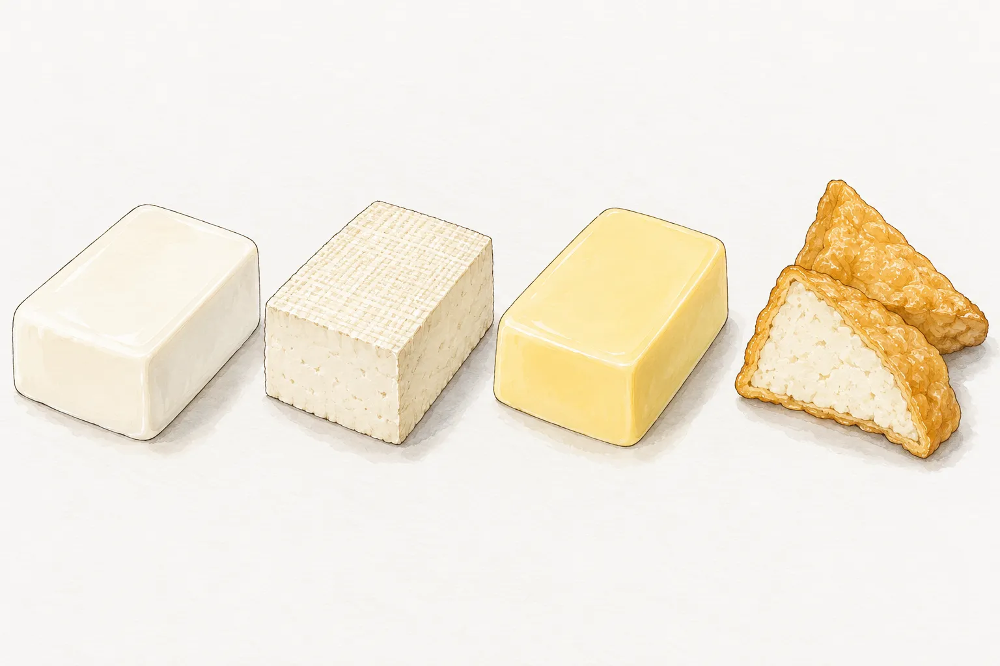
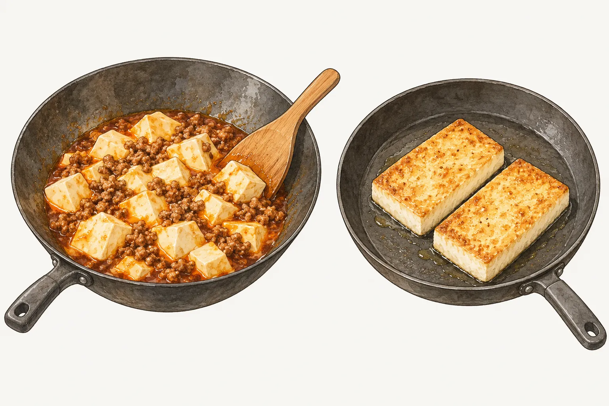

豆腐買回來要煎、燒，還是裹著醬汁吃，挑選時就可以先決定。在市場攤前看見的白色方塊，以及超市盒裝的嫩豆腐、雞蛋豆腐，放進同一口鍋，處理方式各有不同。想吃滑嫩的豆腐丁，可以從麻婆豆腐的做法看起；想要金黃表面，則要連豆腐種類、是否裹粉和下鍋方式一起看。

## 板豆腐的紮實，和加壓脫水有關

農糧署介紹豆腐製程時，從豆漿凝固、加壓脫水，一路談到後續加工。板豆腐用布包裹後加壓成形，口感較紮實；做成之後再油炸，就有油豆腐。這也說明了為什麼買豆腐時，除了看軟硬，還要看它是否已經經過另一道加工。白色板豆腐與金黃油豆腐，可以來自相近的起點，後面的做法卻不必相同。

嫩豆腐與板豆腐的差別，不能只靠盒子的大小判斷。先看包裝上的品名、成分與建議用途，再對照菜譜需要的種類，比看到「豆腐一盒」就直接替換更清楚。雞蛋豆腐又多了蛋的配方；農糧署也另外列出以蛋為主要原料的芙蓉豆腐。名字都帶著豆腐，原料未必一樣。

這張比較圖讓表面與切面放在一起看，購買時仍以實際產品標示為準。需要確認是否含蛋或大豆，就把成分欄一併看完；顏色只能幫忙辨認圖裡的食材，無法代替原料說明。

## 嫩豆腐下鍋後，保留完整的豆腐塊

嫩豆腐適合用醬汁包覆，操作時少一點翻動。Mrs P's Kitchen 的麻婆豆腐做法，先將豆腐瀝乾切塊，炒絞肉、煮醬汁之後才放豆腐，並提醒輕輕拌勻，避免弄散。把肉與調味的拌炒先完成，豆腐入鍋後便不用跟著承受前面的反覆翻炒。

本站的麻婆豆腐選用嫩豆腐，先讓絞肉、辣豆瓣醬與醬汁在鍋裡煮好，再把豆腐丁放進去。這時用鍋鏟輕推，讓豆腐浸到醬汁裡，觀察醬汁再次滾起，接著依菜譜勾芡。最後看的是醬汁有沒有均勻裹住豆腐，以及豆腐丁是否仍保有形狀。

兩份菜譜安排太白粉的先後並不完全相同，照著其中一份做即可，不必把每個步驟拼在一起。要做本站版本，材料與順序都在[麻婆豆腐](/recipes/mapo-tofu/)。嫩豆腐的柔軟是這道菜要保留的口感，下鍋後的動作也跟著放輕。

## 板豆腐煎上色，先處理表面水分

板豆腐可以切成大片，讓平整的一面貼著鍋底煎。龜甲萬的芝麻照燒醬豆腐，先將板豆腐橫切，用廚房紙巾吸掉多餘水分，再灑麵粉下鍋。這份做法的判斷點是兩面金黃，煎好先起鍋，菇類與醬汁另外拌炒後才淋上去。豆腐的煎面和配料的醬汁，分成兩段處理。

這裡的吸水、裹粉是同一份做法的安排。選用板豆腐、保留大片接觸面，再觀察煎色，比把所有豆腐都切成小丁後用力翻動，更符合這道菜的操作。若菜譜沒有寫裹粉，便依那份菜譜處理，不把裹粉當成每一道煎豆腐都必做的步驟。

圖中左邊的嫩豆腐靠醬汁包覆，右邊的板豆腐保留大面積煎色。它們是兩種不同做法的比較，不是同一份豆腐從左做到右。龜甲萬另有用板豆腐裹麵粉油炸、再燒煮勾芡的老皮嫩肉；同一道菜名底下，也可能採用不同豆腐與收尾方式。

## 雞蛋豆腐的配方，要連同菜譜一起看

雞蛋豆腐含蛋，但各產品仍要看自己的成分。食品工業發展研究所的產品資料中，義美雞蛋豆腐同時使用雞蛋與黃豆，並列出煎、炸和火鍋等用途。這是一項產品的說明，不能延伸成市面上所有蛋豆腐都用相同配方，或每一種都能照同樣時間烹調。

本站[老皮嫩肉](/recipes/old-skin-tender-tofu/)選用蛋豆腐，切塊油炸至表面金黃，瀝油後才淋上蔥蒜醬汁。它與前一節龜甲萬使用板豆腐的版本不同：一份讓炸好的豆腐淋醬上桌，另一份還要回鍋燒煮。買材料之前先選定版本，便能知道要準備蛋豆腐還是板豆腐，也能避免炸好之後才發現後續做法不同。

想比較口感時，可以把「豆腐本身」與「外層怎麼處理」分開想。柔軟的蛋豆腐也有油炸的做法；板豆腐則可以煎、炸後再搭醬汁。外面金黃，並不足以判斷裡面是哪一種豆腐。

## 油豆腐已經炸過，接下來看怎麼入菜

油豆腐是加工後的豆腐，採買時就已經有油炸形成的外層。農糧署把它列在板豆腐後續加工的種類裡。挑油豆腐做菜，可以直接找以油豆腐為材料的菜譜，再確認要切開、汆燙，或接著燒煮，省下自行從白豆腐油炸的那一段工序。

龜甲萬的鮮菇燒油豆腐把油豆腐、鮮香菇與紅蘿蔔搭在一起，備料時安排油豆腐汆燙，註明是處理油味。這是該道菜的前處理，不能據此推成所有油豆腐都必須汆燙，也不能把汆燙說成能去掉所有油脂。原食譜沒有交代油豆腐後續下鍋的確切時點，因此這裡只介紹材料搭配與已寫明的備料方式。

龜甲萬的關東煮則把油豆腐對半切，與白蘿蔔、竹輪、蒟蒻等食材同鍋煮。這份做法先處理白蘿蔔，之後才加入其他食材；油豆腐沒有先煎到上色的步驟。想省去煎炸，便可選這類已把油豆腐納入湯鍋的做法，切法和下鍋順序照原菜譜安排，不把白豆腐的煎炸程序再做一次。
