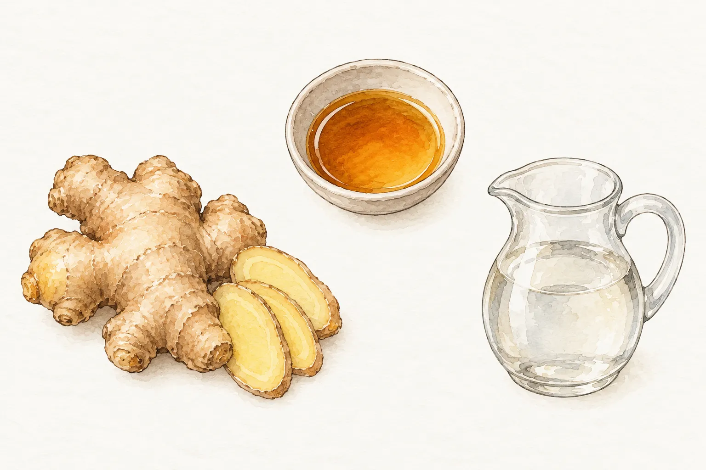
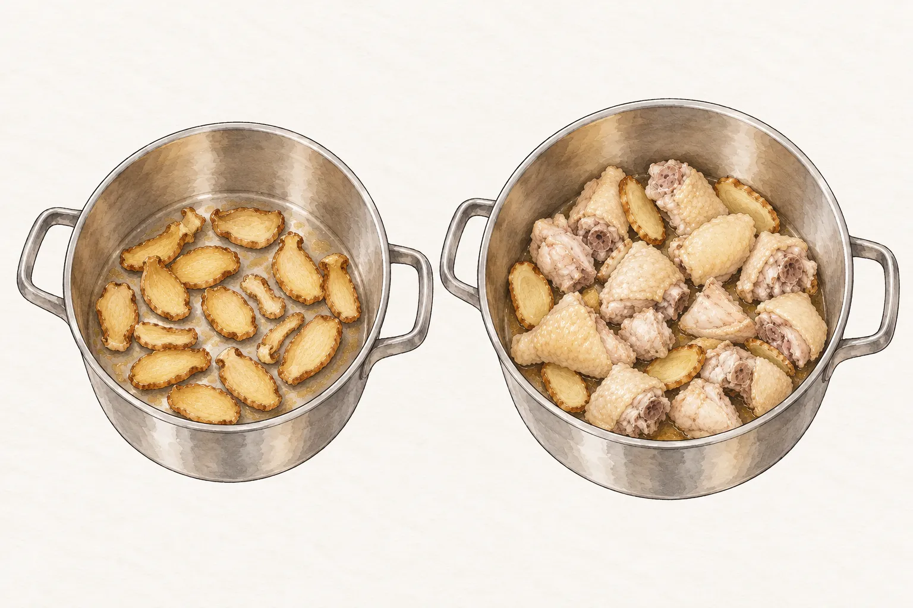
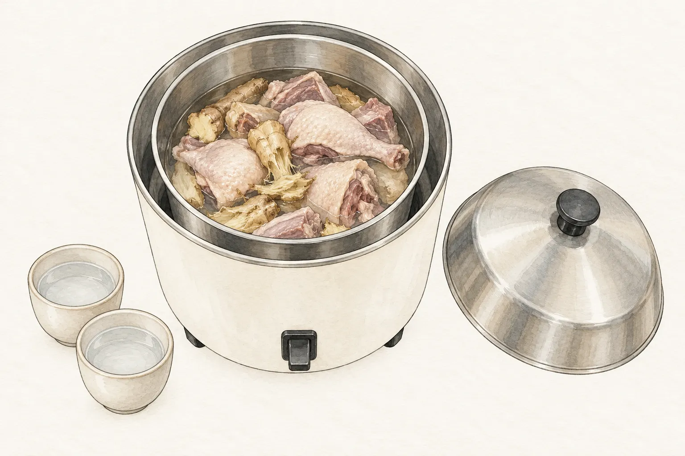
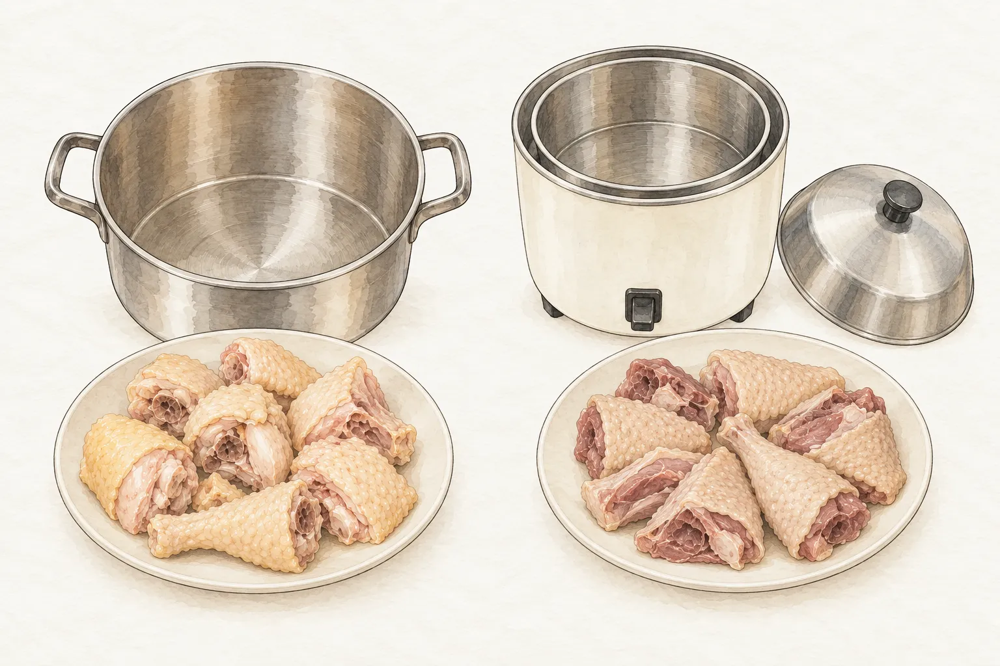

立冬前後，麻油雞酒、薑母鴨常被端上餐桌。台灣民間把這類冬令飲食稱為「補冬」。兩道菜都用老薑、麻油和米酒；在家煮時，肉類、酒水比例和器具，會決定今晚比較適合哪一鍋。

## 補冬不只有一個日子

農業部的節氣資料把立冬列在國曆 11 月 7 日或 8 日，談到水稻收割後的農事景象，也記下民間在立冬吃麻油雞酒等補冬料理。俗諺「補冬補嘴空」也留在這份記錄裡。

教育部《臺灣台語常用詞辭典》把「補冬」解釋為冬令進補，記載北部人在立冬、南部人在冬節吃補冬料理。這是辭典記錄的地方差異，並非每個家庭都照做的日曆。辭典的用例還提到市場有人買番鴨，從買菜的話語也能看到這項習俗。

新北市政府農業局 2020 年立冬前的報導，提到薑母鴨、羊肉爐、燒酒雞的店家，也舉薑片、麻油、米酒和肉類作為家裡煮應景菜的材料。以下兩份配方都用薑、麻油與米酒，雞肉在爐火上煮，鴨肉則交給電鍋。

## 麻油雞：薑片與雞肉在爐火上煮

麻油雞這一鍋以土雞、老薑、麻油、米酒、水和鹽為材料，沒有藥材。薑切片，用麻油小火煸到邊緣微捲；雞肉接著下鍋，炒到表面轉白。鍋裡先後出現的兩個樣子，也是這份做法辨認進度的方式。

米酒與水等量，是這份麻油雞的湯汁配法。煮滾後轉小火，約 40 分鐘到雞骨突出、雞肉軟爛，還要蓋鍋浸泡約 10 到 15 分鐘。爐火煮完後仍有這段等待，安排上桌時間時要一併算進去。

本站的[麻油雞菜譜](/recipes/sesame-oil-chicken/)用土雞 1350 公克、老薑 150 公克，米酒和水各 500 毫升，適合想用爐火煮雞肉與湯汁的人。份量與完整步驟可直接照菜譜準備。

## 薑母鴨：先汆燙，再交給電鍋

薑母鴨這份做法以鴨肉 900 公克、老薑 80 公克為主，搭配麻油、米酒、水和鹽，也沒有藥材。鴨肉在滾水中汆燙 3 分鐘；老薑拍扁後，用麻油小火炒到微乾。這兩項前置工作在爐火上完成，燉煮則交給電鍋。

電鍋內鍋加水 1400 毫升、米酒 200 毫升，外鍋加 2 杯水。水比酒多，和麻油雞的等量酒水不同。開關跳起後加鹽，再燜 10 分鐘；食譜沒有給出電鍋運轉的總分鐘數，開飯時間要為這段行程留些餘裕。

本站的[薑母鴨菜譜](/recipes/ginger-duck/)用麻油 45 毫升，材料表列的是鴨肉與薑酒湯底，沒有另加米血或青菜。若手邊有鴨肉和電鍋，可以從這個版本看完整做法。

## 今天要煮哪一鍋

想在爐火上煮一鍋雞肉與湯汁，看麻油雞；手邊有鴨肉和電鍋，看薑母鴨。前者的米酒與水等量，後者的水比米酒多，備料時可以先照想用的肉類、器具和酒水量決定。這裡比較的兩份菜譜都沒有藥材，材料表也沒有額外鍋料。

若晚餐時間已經排好，麻油雞要留出約 40 分鐘小火燉煮與約 10 到 15 分鐘浸泡；薑母鴨的原食譜未標出電鍋行程的總分鐘數。兩道菜都用了米酒，挑選時也可先看菜譜的用量與步驟。
