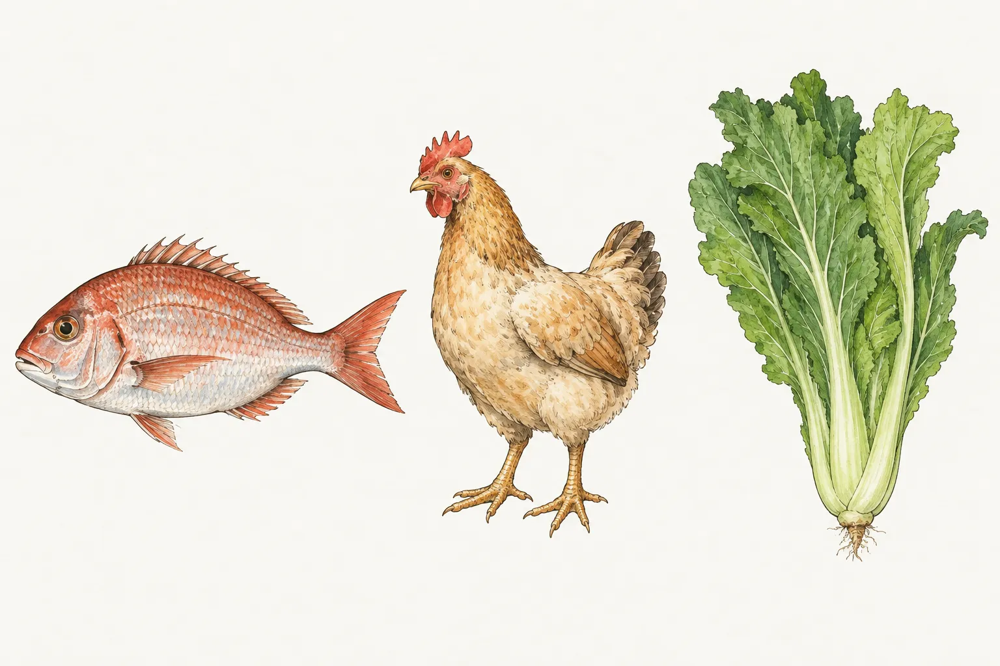
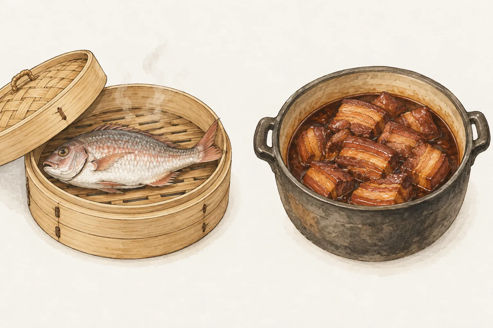

十二月十六是尾牙，除夕晚上是圍爐。國史館臺灣文獻館把尾牙記成一年裡最後一次作牙。國立傳統藝術中心和國立臺灣歷史博物館的藏品說明，把圍爐寫成除夕全家一起吃的年夜飯。

## 尾牙是犒賞，桌上是潤餅和刈包

農曆每逢初二、十六，臺灣文獻館稱為作牙。二月初二是頭牙，十二月十六是一年最後一次，叫做尾牙。這則記錄引《臺灣歲時記》，當天燒土地公金，祭拜福德正神，門前擺長凳，用五味碗供養地基主。

商家行號也在這段時間宴請員工，犒賞過去一年的辛勞。同一則記錄寫，以前若不打算續聘某人，席間會把雞頭朝向那個人。文獻館接著說，這個習俗現在已經消失，公司行號的尾牙改在年度結束前辦成慰勞宴。

家裡食尾牙，文獻館寫的主要食物是潤餅和刈包。潤餅皮裡看得到豆芽、豆乾和筍絲，也放蒜頭與蛋燥，再配花生粉、虎苔、番茄醬。刈包裡是三層肉配鹹菜，另外有筍乾、香菜，還有花生粉。站上沒有這兩道菜譜，這裡只記名稱和餡料。

## 圍爐是除夕的年夜飯

除夕又稱廿九暝或三十暝，舊的一年到這天晚上為止。臺史博藏品說明寫，下午先準備牲禮祭拜祖先和神明，稱為辭年。晚餐才是全家圍著圓桌吃的年夜飯。

圍爐和火爐有關。傳藝中心寫，早年在餐桌下放一只小火爐取暖，火爐代表全家團圓、日子興旺。藏品說明另寫，爐的四周灑上銅錢。現在桌下常常不再放火爐，改成桌上放一口火鍋。火鍋是這份說明裡拿來替代火爐的器物。

辭年的神桌上有春飯。傳藝中心寫，碗裡白米飯盛得高出碗面，插上紙或布剪成的春仔花。臺語「春」和「賰」同音，賰就是剩下的飯，用來表示米飯有餘。藏品說明把同一個音寫成「春」對「剩」，稱作年年有餘。春飯在神桌上，魚在餐桌上，兩份記錄各寫各的。

## 魚、全雞和長年菜

水產試驗所、傳藝中心和客家文化發展中心，分別記下除夕的魚、全雞和長年菜。

### 魚留到除夕之後

農業部水產試驗所有一份蒸吳郭魚的食譜。附註寫，魚和「餘」同音，是除夕會出現的一道菜。習俗是留到除夕過後再吃，或只吃一半，表示還有餘。那份食譜用大火蒸 10 分鐘，調味用魚露。

站上的[清蒸魚](/recipes/steamed-fish/)是另一份做法。材料是整尾鱸魚，蒸熟後鋪青蔥絲、薑絲和辣椒絲，淋上熱油，醬汁用蠔油。完整步驟在菜譜。魚要留到隔日，或只吃一半，依的是水產試驗所那則附註。

### 全雞與食雞起家

傳藝中心寫，除夕的雞一般都用全雞。臺語「雞」和「家」同音，因此有食雞會起家這句話，起家指成家立業。臺史博藏品說明也把全雞的兆頭寫成食雞起家。

單獨一盤雞腿或雞翅，對不上這兩份資料所寫的全雞。站上沒有全雞菜譜，這裡不連。

### 長年菜不切斷

客家文化發展中心寫，除夕圍爐幾乎家家準備長年菜，取長壽的意思。基隆以南到嘉義，以及宜蘭、花蓮、臺東，用的是芥菜，也叫刈菜。南北客家人也以芥菜居多。臺南以南到高雄、屏東，閩南人多用帶根的菠菜，臺語稱菠薐仔，整株連根川燙，吃的時候不切斷。中心引一則南部記錄，這種隔年菜用菠菜，一根、不折斷，過年每人吃一根。

芥菜葉子大。中心寫它帶苦，和有油脂的大骨或雞肉一起煮，味道會轉甘，並把先苦後甘說成苦盡甘來。傳藝中心也把芥菜的長度說成長壽，把先苦後甘說成苦盡甘來。兩份資料都是在講菜的味道和習俗說法。

南部用哪一種菜、怎麼煮，兩份資料寫得不一樣。客家文化發展中心寫到縣市，臺南以南用帶根菠菜，整株川燙，不切斷。傳藝中心寫南部大都用菠菜，連根帶葉蒸煮。站上沒有長年菜菜譜。

## 蒸魚和可以再熱的炆菜

水產試驗所那道除夕魚，蒸 10 分鐘後淋上調味。頁面沒有寫要提前一天蒸。吃剩的部分，依同一則附註，可以留到除夕過後。

可以先做好、之後再熱的，客家委員會客家雲寫在炆菜。炆是用大鍋烹煮，並讓食物維持溫熱。那一頁的四炆是客家爌肉、肥湯炆筍乾、豬肚酸菜湯，以及排骨炆菜頭。文中說這類菜多半放得住，做一次可以分幾頓吃，要吃時再加熱。這是客家宴客菜的特性。頁面沒有把這四道定成除夕菜單。

年菜若沒有立刻吃完，衛生福利部食品藥物管理署要人盡快放進冰箱冷藏。先放涼再冰，署裡認為這個觀念已經過時。再熱要達到 70°C 以上。菜若長時間停在 7 到 60°C，細菌容易繁殖，所以同一道菜不要反覆加熱。
