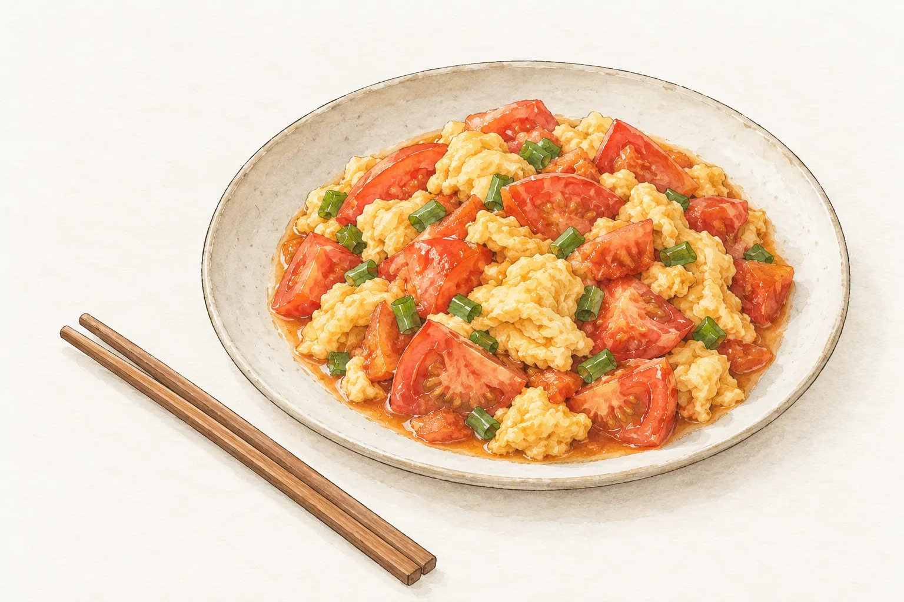

「天氣熱的時候，不開火也能上桌的涼拌菜最省事。」這篇固定資料先從小黃瓜談起，再看豆腐與調味的安排。閱讀時可以先看段落，再對照旁邊的圖片，逐一找到食材、處理方式與醬汁的說明。篇幅稍長的開場讓桌面版至少排出四行，便於確認第一個中文字旁邊的前兩行有留出位置，後面的文字則回到原本的左邊界。這段只是用來檢查文章的閱讀順序、引號與換行，並保留原有的搜尋字詞；往下還能讀到小黃瓜與豆腐的小節，圖片之間也保留一般段落，讓窄螢幕和放大文字時都有足夠內容可供檢查。

## 涼拌小黃瓜

小黃瓜拍裂後加鹽放著，擠掉水分再調味。

### 調味比例

蒜末、醋與醬油依個人口味調整。

## 涼拌豆腐

選用嫩豆腐，淋上醬汁即可。

